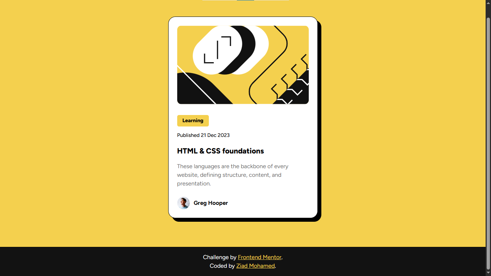

# 📝 Blog Preview Card

  

A responsive blog preview card built with HTML and CSS as part of a Frontend Mentor challenge.

## 📖 About the Challenge

This project is a solution to a Frontend Mentor challenge focused on building a clean, responsive card component from a provided design.

## ✨ Highlights

- 📱 Responsive card layout.
- 🎨 Interactive hover effect on the article title.
- 🧱 Semantic HTML structure.
- 🖼️ Clean spacing and visual hierarchy.
- 📐 Modern CSS using the `min()` function.

## 🛠️ Built With

  

## 💡 Key Takeaways

Throughout this project, I practiced:

- Building responsive card layouts.
- Using the `min()` CSS function for responsive sizing.
- Creating interactive hover states.
- Organizing content with semantic HTML.
- Understanding when using CSS classes is clearer than relying on structural selectors.

## 🔗 Links

- 🌐 **Live Site:** https://frontend-mentor-blog-preview-card-tau-ruddy.vercel.app/
- 💻 **Repository:** https://github.com/Ziad-mo205/Frontend-Mentor---Blog-Preview-Card
- 🎯 **Frontend Mentor Solution:** 